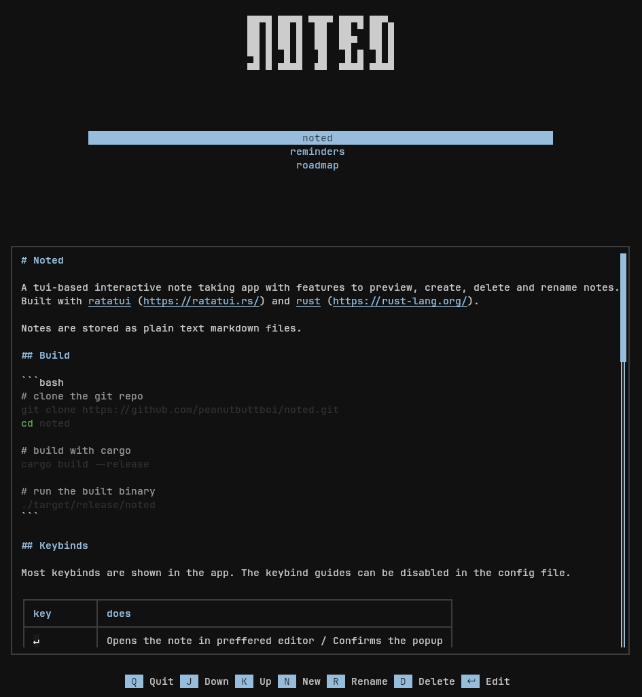

# Noted
A tui-based interactive note taking app with features to preview, create, delete and rename notes.
Built with [ratatui](https://ratatui.rs/) and [rust](https://rust-lang.org/).

Notes are stored as plain text markdown files.


## Installation
Linux/MacOS:
```bash
curl --proto '=https' --tlsv1.2 -LsSf https://github.com/peanutbuttboi/noted/releases/download/v0.2.0/noted-installer.sh | sh

```
Windows:
```ps1
powershell -ExecutionPolicy Bypass -c "irm https://github.com/peanutbuttboi/noted/releases/download/v0.2.0/noted-installer.ps1 | iex"

```

Or download the prebuilt binaries for your platform from the [Releases](https://github.com/peanutbuttboi/noted/releases) page.

## Build

```bash
# clone the git repo
git clone https://github.com/peanutbuttboi/noted.git
cd noted

# build with cargo
cargo build --release

# run the built binary
./target/release/noted
```

## Keybinds

Most keybinds are shown in the app. The keybind guides can be disabled in
the config file.

| key | does |
|---|---|
| `↵` | Opens the note in preferred editor / Confirms the popup |
| `j` / `↓` | Next note in the list |
| `k` / `↑` | Previous note in the list |
| `C-j` / `C-d` | Scroll down the preview |
| `C-k` / `C-u` | Scroll up the preview |
| `n` | Create a new note |
| `r` | Rename a note |
| `d` | Delete a note |
| `q` / `Esc` | Quit |

## Configuration

`noted` looks for the config file at `~/.config/noted/config.toml` (on linux).

Here is an example config file:

```toml
# Notes directory
notes_dir = "~/notes"

# UI related configuration
[ui]
# Header text
header = """
▄▄▄▄ ▄▄▄▄ ▄▄▄▄ ▄▄▄▄ ▄▄▄ 
██ █ ██ █  ██  ██ ▀ ██ █
██ █ ██ █  ██  ██▀  ██ █
▀█ █  █ █  ▐█   █ █  █ █
▀▀ ▀ ▀▀▀▀  ▀▀  ▀▀▀▀ ▀▀▀▀"""

# Display guides
show_guides = true

# The accent color. format: #RRGGBB (leave empty for default accent)
accent = ""

```

## AI Usage

AI was used during the learning process but no code is LLM-written. All of it is human-made slop,
no AI-slop included. However, I'm not against AI usage. AI-assisted contributions are welcome
as long as they are thoroughly reviewed by a human.

## License

MIT. See [LICENSE](LICENSE).
